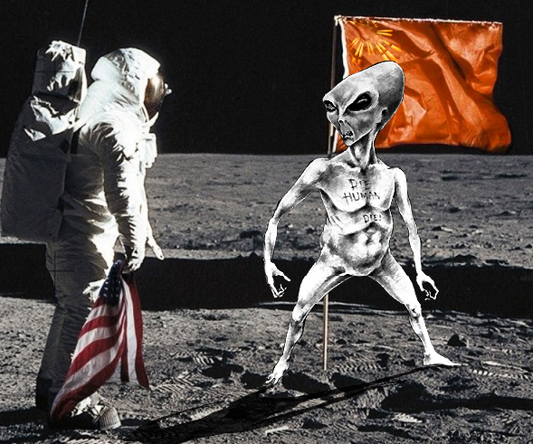

# IGDC.RU - Конкурс №119 "SSP"

[Конкурс](http://igdc.ru/igdc_top.php?konkurs=119) на [igdc.ru](http://igdc.ru/) который проходил с 12 по 26 февраля 2015г.

## Правила:

_"Земля — колыбель человечества, но нельзя вечно оставаться в колыбели."_
К.Э. Циолковский.

Исследование космических глубин, колонизация далеких планет и полеты по бесконечности - весьма достойное занятие.
Необходимо создать игру, в которой уживаются космос, реактивная тяга и физика дедушки Ньютона. Ну и высадки на далекие планеты.
Темой этого конкурса становятся космические симуляторы.

**Обязательные элементы:**

* Планеты;
* Управляемый игроком космический корабль;
* Гравитационное взаимодействие (по возможности честное);

**Бонусы будем давать за:**

* Мирный космос. Космические войны не рациональны и крайне дороги. Бонус будет даваться за игру с мирными целями. Космические перелеты и изучение далеких планет - наше все.
* Ступени. Администрация обожает многоступенчатые ракеты и не раскаивается за миллионы тонн сгоревшего химического топлива. Естественно, их применение должно быть оправданно, просто разваливающегося на части кораблика недостаточно.

Формула реактивного движения бессердечна к космическим путешественникам, полноценная физика взаимодействия гравитационных тел не очень проста, а масштаб планет и расстояния между ними - невообразимо громадны. Для конкурса их точное соблюдение не обязательно. Горючее и кислород могут быть бесконечными, а планеты могут быть прибиты гвоздями к небесной сфере. 2D или 3D - решайте сами.
Системы анабиоза, фотонные двигатели, гиперпространственные порталы не запрещены.

Эксперимент с полной открытостью продолжается - можно(и нужно) публиковать все, от скриншотов до сборок альфа версий игр.

Конкурс продлится по **26 февраля** включительно, ограничений на размер работ нет.
